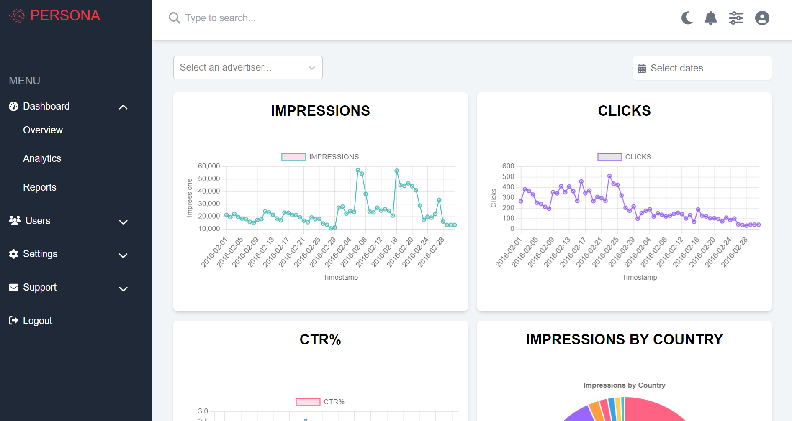

# Persona Ads Dashboard Documentation

## Overview

The [**Persona Ads Dashboard**](https://persona-ads-dashboard.vercel.app/) is a react web application designed to analyze and visualize advertising metrics. It allows users to filter data, view graphical representations of metrics, and gain insights into advertising performance.


## Table of Contents

1. [Getting Started](#getting-started)
2. [Project Structure](#project-structure)
3. [Project Dependencies](#project-dependencies)
4. [Core Features](#core-features)
5. [Components](#components)
6. [State Management](#state-management)
7. [Data Processing](#data-processing)
8. [Customization](#customization)
9. [Deployment](#deployment)
10. [Contribution](#contribution)

## Getting Started

### Prerequisites

- [Node.js](https://nodejs.org/en/download/package-manager/current)
- [npm](https://docs.npmjs.com/downloading-and-installing-node-js-and-npm) or [yarn](https://classic.yarnpkg.com/lang/en/docs/install/#windows-stable)
- [Tailwind CSS](https://tailwindcss.com/docs/guides/create-react-app)

### Installation

Clone the repository:

1. Clone the repository:

   ```bash
   git clone https://github.com/Keshav-Rai009/persona-ads-dashboard.git
   cd persona-ads-dashboard
   ```

2. Install dependencies:

   ```bash
   npm install
   # or
   yarn install
   ```

3. Start the development server:

   ```bash
   npm start
   # or
   yarn start
   ```

   Open [localhost](http://localhost:3000) to view it in the browser.

4. Build the project (production):

   ```bash
   npm run build
   # or
   yarn build
   ```

### Project Structure

```mathematica
persona-ads-dashboard/
├── public/
| ├── configs
| | ├── ad-metrices.yml
| | ├── navigation.yml
└── ...
├── src/
| ├── assets/
| | ├── datasets/
| | ├── images/
| | ├── videos/
│ ├── components/
│ │ ├── analytics/
│ │ │ ├── MetricAnalytics.js
│ │ │ ├── MetricInsights.js
│ │ │ ├── Graph.js
│ │ │ ├── LineGraph.js
│ │ │ ├── BarGraph.js
│ │ │ └── PieChart.js
| | ├── core/
| | | ├── AppRoutes.js
| | | └── ...
│ │ └── ...
│ ├── redux/
│ │ ├── store.js
│ │ ├── csvDataSlice.js
│ │ └── ...
│ ├── util/
│ │ ├── AnalyticsUtil.js
│ │ └── ...
│ ├── App.js
│ ├── index.js
│ └── ...
├── package.json
└── README.md
```

### Project Dependencies

The following external dependencies are used in this project:

```json
"dependencies": {
    "tailwindcss": "^3.4.3", // For styling
    "@fortawesome/fontawesome-svg-core": "^6.5.2", // To display app icons.
    "@fortawesome/free-solid-svg-icons": "^6.5.2", // Solid style icons for FontAwesome.
    "@fortawesome/react-fontawesome": "^0.2.2", // FontAwesome React component integration.
    "@reduxjs/toolkit": "^2.2.5", // For state management
    "chart.js": "^4.4.3", // To render data visuals like graphs and charts.
    "js-yaml": "^4.1.0", // To parse yaml files.
    "papaparse": "^5.4.1", // To parse given CSV files.
    "react-calendar": "^5.0.0", // To display calender for date range.
    "react-chartjs-2": "^5.2.0", // React wrapper for Chart.js.
    "react-redux": "^9.1.2", // Official React bindings for Redux.
    "react-router-dom": "^6.23.1", // For navigation.
    "react-select": "^5.8.0", // For advertiser filter.
    "redux": "^5.0.1", // Predictable state container for JavaScript apps.
}
```

### Core Features

- Data Visualization: View line graphs, bar charts, and pie charts representing various metrics.
- Filters: Filter data by date range and advertiser.
- Metric Insights: Get detailed insights of each metric such as average, max, total values, and trends.

- **Contribution Model - A config driven architecture:**

  The app presents a unique config driven architecture where you can customise a lot by changing simple config files:

  - [`ad-metrices.yml`](./public/configs/ad-metrices.yml): This file contains all the key metrices of your ads which are highly configurable. You can edit this yaml file to modify your metrices or graph's apperance. You can also add new metrices or remove the existing ones' in case of future updates.

  ```yml
  - name: <Title of your graph>
  type: <Data Representation: <line | bar | pie>
  label: <The x cordinate of graph. e.g. Timestamp for metric vs daily data>
  visuals:
      <Graph apperance fields like color, tension etc>
  ...
  ```

  - [`navigation.yml`](./public/configs/navigation.yml): The file contains all the navigation fields of your app. This can be extremely useful while using _**permissions model**_ in your application. e.g. Based on the user role you can configure this yaml file, and decide whether to give him settings option (admin role)
    or not.

    ```yml
    - label: <Navigation field name>
    subLinks:
        - label: <Sublink 1>
        - label: <Sublink 2>
        ...
    ...
    ```

  - [`key-insights.yml`](./public/configs/key-insights.yml): It contains all the configurable statistical parameters and key insights based on input data.

    ```yml
      ---
      <visual_type>:
      - name: <parameter name>
         key: <mapped key>
         showMetricTitle: < true | false >
         icon:
            name: <icon name>
            color: <icon color>
      ...
    ...
    ```

This architecture gives a high sense of _control_ and _flexibilty_ to the contributors for managing the upcoming features or modifying the existing ones' making our code **highly extensible.**

### Core Components

#### Overview

- Provides you an overall data visualisation for your key metrices.

  | Key Metric               | Representation |
  | ------------------------ | -------------- |
  | _Impressions_            | _Line Graph_   |
  | _Clicks_                 | _Line Graph_   |
  | _CTR_                    | _Bar Graph_    |
  | _Impressions by country_ | _Pie Chat_     |



#### MetricAnalytics


Props:

- `metricData`: The data and configuration for the graph.
- `insightsData`: Insights related to the metric.
- `customisations`: Custom styling and filter controls.

#### MetricInsights

Displays insights such as total, average, max values, and trends for a metric.

#### Graph

Props:

- `title`: Title of the graph.
- `type`: Type of graph (line, bar, pie).
- `data`: Data to be visualized.
- `options`: Configuration options for the graph.
- `customisations`: Custom styling and filter controls.

#### State Management

- The application uses Redux for state management. The relevant slice is csvDataSlice.js, which stores raw csv data, processed csv data, and key metric insights.
- **The csv data is stored in redux store on start of the application and memoised.** This store data is used everywhere else. This not only makes our data immutable, but also improves app performance significantly by not loading the csv files time and again.

#### Data Processing

extractMetricInsights

- Extracts insights from the CSV data, such as average, total, max values, and trends.

filterDataByAdvertiser

- Filters the data based on the selected advertiser.

filterDataByDateRange

> **Note**:  
> The filter does not apply to impressions per country data of the pie chart.

- Filters the data based on the selected date range.

### Customization

Styling:

The application majorly uses **Tailwind CSS** for styling along with some custom css classes written in `/index.css` file.

Contribution Model:
You can make use of configs defined under public folder to customise your data models and website apperance. Find more details [here](#core-features).

Adding New Graphs:

1. Create a new graph component in `components/analytics/`.
2. Update the `Graph` component to include the new graph type.
3. You can configure the graph properties in `/configs/ad-metrices.yml`

### Deployment

Remote Server
Build the application:

```bash
npm run build
# or
yarn build
```

Deploy the contents of the build folder to your remote server. You can use services like Netlify, Vercel, or traditional hosting providers.

> **NOTE**:  
> **I've used _vercel_ for remote deployment of my application - see [_live demo_](https://persona-ads-dashboard.vercel.app/).**

### Contribution

1. Fork the repository
2. Create a new branch

```bash
   git checkout -b feature-name
```

3. Make your changes
4. Commit your changes

```bash
   git commit -m "New feature"
```

5. Push to the branch

```bash
   git push origin feature-name
```

6. Open a Pull Request

## `HAPPY HACKING!`
